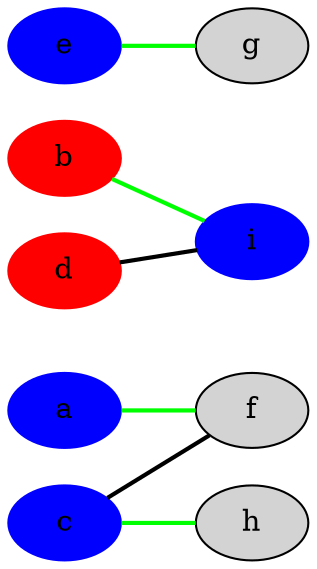

---
plugins:
  - mathjax
  - viz.js
---

# Test

<i>$a^2 + b^2 = c^2$</i>

```graphviz
graph G1 {
    rankdir=LR
    node [style=filled]
    edge [penwidth=2]

    a -- f [color=green]
    b -- i [color=green]
    c -- f
    c -- h [color=green]
    d -- i
    e -- g [color=green]

    d [color=red]
    i [color=blue]
    b [color=red]
    a [color=blue]
    c [color=blue]
    e [color=blue]
}
```
