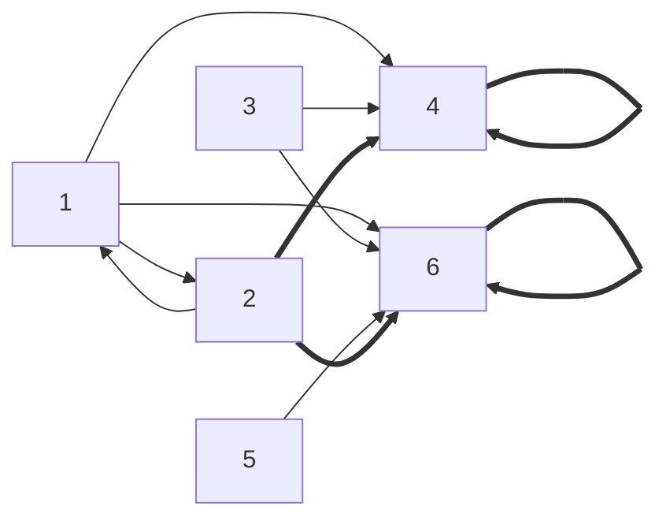

# Diskretne strukture (FiM) - vaje 26.11.2020

---

## Relacije

* Množice: model predikatnega računa s predikatom $\in$
* ($n$-mestna) relacija $R \subseteq A_1 \times A_2 \times \cdots \times A_n$
* (Dvojiška) relacija na množici $A$: $R \subseteq A \times A = A^2$
* Pišemo $a \, R \, b \iff (a, b) \in R$

Lastnosti:

1. refleksivnost: <i>$\forall a \in A: a \, R \, a$</i>
2. irefleksivnost: <i>$\forall a \in A: \lnot (a \, R \, a)$</i>
3. simetričnost: <i>$\forall a, b \in A: (a \, R \, b \Rightarrow b \, R \, a)$</i>
4. asimetričnost: <i>$\forall a, b \in A: (a \, R \, b \Rightarrow \lnot (b \, R \, a))$</i>
5. antisimetričnost: <i>$\forall a, b \in A: (a \, R \, b \land b \, R \, a \Rightarrow a = b)$</i>
6. tranzitivnost: <i>$\forall a, b, c \in A: (a \, R \, b \land b \, R \, c \Rightarrow a \, R \, c)$</i>
7. intranzitivnost: <i>$\forall a, b, c \in A: (a \, R \, b \land b \, R \, c \Rightarrow \lnot (a \, R \, c))$</i>
8. sovisnost: <i>$\forall a, b \in A: (a \ne b \Rightarrow a \, R \, b \lor b \, R \, a)$</i>
9. stroga sovisnost: <i>$\forall a, b \in A: (a \, R \, b \lor b \, R \, a)$</i>
10. enoličnost: <i>$\forall a, b, c \in A: (a \, R \, b \land a \, R \, c \Rightarrow b = c)$</i>

Operacije z relacijami:
* <i>$a \, (R \cup S) \, b \iff a \, R \, b \lor a \, S \, b$</i>
* <i>$a \, (R \cap S) \, b \iff a \, R \, b \land a \, S \, b$</i>
* <i>$a \, (R \setminus S) \, b \iff a \, R \, b \land \lnot (a \, S \, b)$</i>
* <i>$a \, (R * S) \, b \iff \exists c \in A: (a \, R \, c \land c \, S \, b)$</i>
* <i>$a \, R^{-1} \, b \iff b \, R \, A$</i>
* <i>$R^k = R * R * \cdots * R$</i> (<i>$k > 0$</i> krat)
* <i>$R^{-k} = (R^k)^{-1}$</i>
* <i>$R^0 = Id_A = \lbrace (a, a) \mid a \in A \rbrace$</i>

---

### Naloga 1

Dani sta relaciji <i>$R,S$</i> na množici <i>$A=\lbrace 1,2,3,4,5,6 \rbrace$</i>:

$$
\begin{aligned}
R &= \{(1,2),(1,4),(1,6),(2,1),(3,4),(3,6),(5,6)\} \\
\text{in} \quad
S &= \{(2,4),(2,6),(4,4),(6,6)\}.
\end{aligned}
$$

1. Določi relaciji <i>$R^{-1}$</i> in <i>$R*S$</i>.
2. Katere od naslednjih lastnosti ima relacija <i>$R$</i>: refleksivnost, irefleksivnost, simetričnost, asimetričnost, antisimetričnost, tranzitivnost, sovisnost, strogo sovisnost?

----

1. * <i>$R^{-1} = \lbrace (2, 1), (4, 1), (6, 1), (1, 2), (4, 3), (6, 3), (6, 5) \rbrace$</i>
* <i>$R * S = \lbrace (1, 4), (1, 6), (3, 4), (3, 6), (5, 6) \rbrace$</i>

2. * refleksivna: ne
   * irefleksivna: ja
   * simetrična: ne
   * asimetrična: ne
   * antisimetrična: ne
   * tranzitivna: ne
   * sovisna: ne
   * strogo sovisna: ne

---

### Naloga 2

Na množici dvomestnih naravnih števil definiramo relacijo <i>$Q$</i> takole:

$$
x_1x_2 \ Q \ y_1y_2 \ \Leftrightarrow \ x_1 \ge y_1 \ \mbox{ali} \ x_2 > y_2.
$$

1. Kateri pari števil so med sabo v relaciji <i>$Q$</i>: <i>$72,75,82,85$</i>?
2. Katere od naslednjih lastnosti ima relacija <i>$Q$</i>: refleksivnost, irefleksivnost, simetričnost, asimetričnost, antisimetričnost, tranzitivnost, sovisnost, strogo sovisnost?

----

1. * <i>$72 \, Q \, 72$, $72 \, Q \, 75$, $\lnot (72 \, Q \, 82)$, $\lnot (72 \, Q \, 85)$</i>
   * <i>$75 \, Q \, 72$, $75 \, Q \, 75$, $75 \, Q \, 82$, $\lnot (75 \, Q \, 85)$</i>
   * <i>$82 \, Q \, 72$, $82 \, Q \, 75$, $82 \, Q \, 82$, $82 \, Q \, 85$</i>
   * <i>$85 \, Q \, 72$, $85 \, Q \, 75$, $85 \, Q \, 82$, $85 \, Q \, 85$</i>
2. * refleksivnost: ja
   * irefleksivnost: ne
   * simetričnost: ne
   * asimetričnost: ne
   * antisimetričnost: ne
   * tranzitivnost: ne
   * sovisnost: ja
   * stroga sovisnost: ja

---

### Naloga 3

Na <i>$\mathbb{N}$</i> definiramo naslednjo relacijo:

$$
m \, R \, n \ \Leftrightarrow \ mn \text{ je kvadrat naravnega števila}.
$$

1. Pokaži, da je <i>$R$</i> ekvivalenčna relacija.
2. Poišči <i>$R[30]$</i> in <i>$R[12]$</i>.
3. Poišči tako množico <i>$A\subseteq\mathbb{N}$</i>, ki bo vsebovala natanko en element iz vsakega ekvivalenčnega razreda.

----

Relacija $R$ je *ekvivalenčna*, če je
* refleksivna,
* simetrična,
* tranzitivna.

- *Ekvivalenčni razred* <i>$R[a] = \lbrace b \in A \mid a \, R \, b \rbrace$</i>
- *Faktorska množica* <i>$A/R = \lbrace R[a] \mid a \in A \rbrace$</i>

----

1. * refleksivnost:
     - vzamemo <i>$n \in \mathbb{N}$</i>
     - dokazujemo <i>$n \, R \, n \iff n^2$</i> je kvadrat naravnega števila, očitno res
     - QED
   * simetričnost:
     - vzamemo <i>$m, n \in \mathbb{N}$</i>
     - predpostavimo <i>$m \, R \, n$</i>, dokazujemo <i>$n \, R \, m$</i>
     - <i>$m \, R \, n \Rightarrow mn = nm$</i> je kvadrat <i>$\Rightarrow n \, R \, m$</i>
     - QED
   * tranzitivnost:
     - vzamemo <i>$m, n, k \in \mathbb{N}$</i>
     - predpostavimo <i>$m \, R \, n$</i>, <i>$n \, R \, k$</i>, dokazujemo <i>$m \, R \, k$</i>
     - <i>$m \, R \, n \land n \, R \, k \Rightarrow mn, nk$</i> sta kvadrata <i>$\Rightarrow mn^2k$</i> je kvadrat <i>$\Rightarrow mk$</i> je kvadrat <i>$\Rightarrow m \, R \, k$</i>
     - QED
   * torej je <i>$R$</i> ekvivalenčna relacija (če <i>$0 \not\in \mathbb{N}$</i>)

2. * <i>$R[30] = \lbrace 30m^2 \mid m \in \mathbb{N} \rbrace$</i>
     - <i>$30 \, R \, n \iff 30n$ je kvadrat $\iff n = 2 \cdot 3 \cdot 5 \cdot m^2$</i>
     - <i>$30 = 2 \cdot 3 \cdot 5$</i>
   * <i>$R[12] = \lbrace 3m^2 \mid m \in \mathbb{N} \rbrace = R[3]$</i>
     - <i>$12 = 2^2 \cdot 3$</i>

3. <i>$A = \lbrace \prod_{p \in P} p \mid P \subset \mathbb{P} \text{ končna}\rbrace$</i> (kjer je <i>$\mathbb{P}$</i> množica vseh praštevil)

---

### Naloga 4

Na <i>$\mathbb{N}$</i> definiramo naslednjo relacijo:

$$
a \, R \, b \ \Leftrightarrow  \ 7 \,|\, (5a+2b).
$$

1. Pokaži, da je <i>$R$</i> ekvivalenčna relacija.
2. Določi ekvivalenčne razrede relacije <i>$R$</i>.
3. Poišči še faktorsko množico <i>$\mathbb{N}/R$</i>.

---

### Naloga 5

Naj bodo <i>$R, S, T$</i> relacije na množici <i>$A$</i>. Pokaži, da velja:

1. <i>$(R * S)^{-1}=S^{-1} * R^{-1}$</i>,
2. <i>$R * (S\cup T) = (R * S)\cup (R * T)$</i>,
3. <i>$R * (S\cap T) \subseteq (R * S)\cap (R * T)$</i>. Poišči še primere relacij <i>$R,S,T$</i>, za katere enakost ne velja.

----

1. * Dokazujemo <i>$\forall a, b \in A: (a \, (R * S)^{-1} \, b \iff a \, (S^{-1} * R^{-1}) \, b)$</i>
   * Vzamemo poljubna <i>$a, b \in A$</i>, dokazujemo ekvivalenco
   * $$
     \begin{aligned}
     a \, (R * S)^{-1} \, b
     &\iff b \, (R * S) \, a \\
     &\iff \exists c \in A: (b \, R \, c \land c \, S \, a) \\
     &\iff \exists c \in A: (a \, S^{-1} \, c \land c \, R^{-1} \, b) \\
     &\iff a \, (S^{-1} * R^{-1}) \, b
     \end{aligned}
     $$

---

### Naloga 6

Naj bo <i>$A = \lbrace 1, 2, 3, 4 \rbrace$</i> in <i>$R = \lbrace (1, 2), (2, 3), (3, 1), (4, 3) \rbrace$</i>. Ali je <i>$R$</i> tranzitivna? Izračunaj <i>$R^2$</i>, <i>$R^3$</i>, <i>$R^4$</i>, <i>$R^{2020}$</i>, <i>$R^+$</i> in <i>$R^*$</i>.

---

### Naloga 7

Vsako naravno število <i>$n$</i> lahko enolično zapišemo kot produkt potenc različnih praštevil. Definirajmo funkcijo <i>$f:  \mathbb{N}  \to  \mathbb{N}$</i> s predpisom

$$
f(p_1^{\alpha_1} \dots p_k^{\alpha_k})
= p_1\cdot \alpha_1 + \dots + p_k \cdot \alpha_k.
$$

Na množici <i>$\mathbb{N}$</i> potem definiramo relacijo <i>$R$</i> takole:

$$
n \, R \, m \ \Leftrightarrow \ f(n) = f(m).
$$

Pokaži, da je relacija <i>$R$</i> ekvivalenčna relacija. Določi ekvivalenčni razred, v katerem je število <i>$25$</i>.