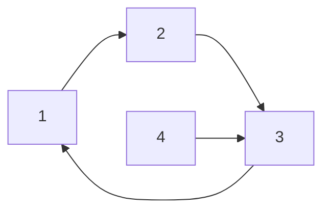
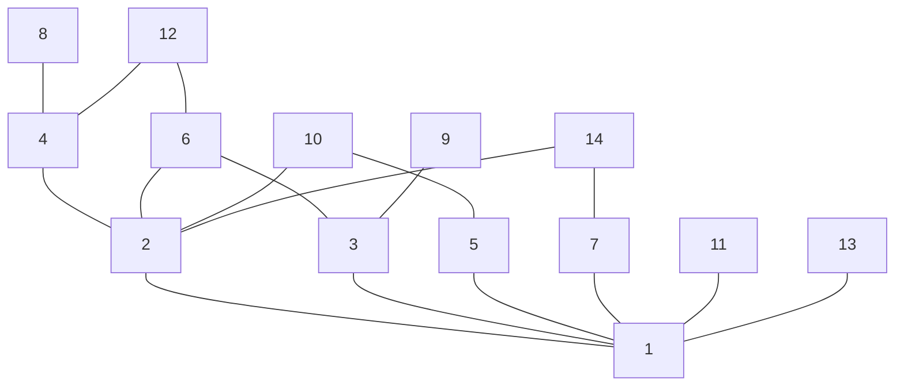

# Diskretne strukture (FiM) - vaje 4.12.2020

---

## Relacije

* <i>$R^k = R * R * \cdots * R$</i> (<i>$k$</i> relacij)
* <i>$R^a * R^b = R^{a+b}$</i> če imata <i>$a$</i> in <i>$b$</i> enak predznak
* <i>$R * R^{-1} \subseteq Id_A$</i>
* <i>$R^+ = R \cup R^2 \cup R^3 \cup \ldots$</i> tranzitivna ovojnica
* <i>$R^* = R^0 \cup R \cup R^2 \cup R^3 \cup \ldots$</i> tranzitivno-refleksivna ovojnica

---

### Naloga 1

Naj bo <i>$A = \lbrace 1, 2, 3, 4 \rbrace$</i> in <i>$R = \lbrace (1, 2), (2, 3), (3, 1), (4, 3) \rbrace$</i>. Ali je <i>$R$</i> tranzitivna? Izračunaj <i>$R^2$</i>, <i>$R^3$</i>, <i>$R^4$</i>, <i>$R^{2020}$</i>, <i>$R^+$</i> in <i>$R^*$</i>.

----

* <i>$R$</i> ni tranzitivna relacija
* <i>$R^2 = \lbrace (1, 3), (2, 1), (3, 2), (4, 1) \rbrace = R^5$</i>
* <i>$R^3 = \lbrace (1, 1), (2, 2), (3, 3), (4, 2) \rbrace = R^6$</i>
* <i>$R^4 = \lbrace (1, 2), (2, 3), (3, 1), (4, 3) \rbrace = R = R^7$</i>
* <i>$R^{2020} = R^{3 \cdot 673 + 1} = R$</i>
* <i>$R^+ = \lbrace (1, 1), (1, 2), (1, 3), (2, 1), (2, 2), (2, 3), (3, 1), (3, 2), (3, 3), (4, 1), (4, 2), (4, 3) \rbrace$</i>
* <i>$R^* = \lbrace (1, 1), (1, 2), (1, 3), (2, 1), (2, 2), (2, 3), (3, 1), (3, 2), (3, 3), (4, 1), (4, 2), (4, 3), (4, 4) \rbrace$</i>

---

## Urejenosti

* Delna urejenost <i>$\le$</i>:
    - refleksivna
    - antisimetričnost
    - tranzitivnost

* Linearna urejenost:
    - delna urejenost
    - (strogo) sovisna

+ <i>$a$</i> je minimalni element, če <i>$\forall x: (x \le a \Rightarrow x = a)$</i>
+ <i>$a$</i> je maksimalni element, če <i>$\forall x: (a \le x \Rightarrow x = a)$</i>
+ <i>$a$</i> je prvi element, če <i>$\forall x: a \le x$</i>
+ <i>$a$</i> je zadnji element, če <i>$\forall x: x \le a$</i>

---

### Naloga 2

Na <i>$\mathbb{R}^2$</i> definiramo relacijo <i>$R$</i> takole:

$$
(x,y) \, R \, (z,w) \ \Leftrightarrow \ y\leq w \text{ in } x-y\leq z-w.
$$

Pokaži, da je <i>$R$</i> delna urejenost.

----

* Refleksivnost:
  - <i>$(x, y) \, R \, (x, y) \iff y \le y \land x-y \le x-y$</i> je res
* Antisimetričnost:
  - $$
    \begin{aligned}
    (x, y) \, R \, (z, w) \land (z, w) \, R \, (x, y)
    &\Rightarrow y \le w \land x-y \le z-w \land w \le y \land z-w \le x-y \\
    &\Rightarrow y = w \land x-y = z-w \\
    &\Rightarrow x = z \land y = w \\
    &\Rightarrow (x, y) = (z, w)
    \end{aligned}
    $$
* Tranzitivnost:
  - $$
    \begin{aligned}
    (x, y) \, R \, (z, w) \land (z, w) \, R \, (u, v)
    &\Rightarrow y \le w \land x-y \le z-w \land w \le v \land z-w \le u-v \\
    &\Rightarrow y \le v \land x-y \le u-v \\
    &\Rightarrow (x, y) \, R \, (u, v)
    \end{aligned}
    $$

---

### Naloga 3

Dana je množica <i>$A=\lbrace 1,2,\dots,14 \rbrace$</i>. Nariši Hassejev diagram za delno urejenost <i>$(A, \mid)$</i>. Določi še minimalne, maksimalne, prve in zadnje elemente.

----

* prvi element, edini minmalni element: <i>$1$</i>
* zadnjega elementa ni
* maksimalni elementi: <i>$8, 12, 9, 10, 14, 11, 13$</i>

---

### Naloga 4

Vsako naravno število <i>$n \in \mathbb{N}$</i> lahko enolično zapišemo v obliki <i>$n = 2^p(2q+1)$</i>. V <i>$\mathbb{N}$</i> vpeljemo urejenosti <i>$\prec$</i> in <i>$\preceq$</i> takole. Naj bo <i>$n=2^p(2q+1)$</i> in <i>$m = 2^u(2v+1)$</i>. Potem je:

$$
\begin{alignedat}{2}
n &\prec m &\ &\Leftrightarrow \ p < u \lor (p = u \land q < v) \quad \text{in} \\
n &\preceq m &\ &\Leftrightarrow \ n=m \lor n \prec m.
\end{alignedat}
$$

1. Pokaži, da je <i>$\preceq$</i> delna urejenost.
2. Ali je <i>$\preceq$</i> linearna urejenost?
3. Uredi množico <i>$\lbrace 1,2,3,4,5,6,7,8,9 \rbrace$</i> glede na <i>$\prec$.</i>
4. Določi najmanjši element glede na <i>$\preceq$</i> v množici <i>$\lbrace n \in \mathbb{N} \mid 100 \leq n \leq 200 \rbrace$</i>.
5. Določi neposrednega naslednika števila <i>$96$</i> glede na <i>$\preceq$</i>.

----

1. * Refleksivnost:
     - <i>$n \preceq n \iff n = n \lor n \prec n$</i> velja
   * Antisimetričnost (<i>$n = 2^p(2q+1)$</i>, <i>$m = 2^u(2v+1)$</i>):
     - $$
       \begin{aligned}
       n \preceq m \land m \preceq n
       &\Rightarrow (n = m \lor n \prec m) \land (m = n \lor m \prec n) \\
       &\Rightarrow n = m \lor ((p < u \lor (p = u \land q < v)) \land (u < p \lor (u = p \land v < q))) \\
       &\Rightarrow n = m \lor (p = u \land q < v \land v < q) \\
       &\Rightarrow n = m
       \end{aligned}
       $$
   * Tranzitivnost (<i>$n = 2^p(2q+1)$</i>, <i>$m = 2^u(2v+1)$</i>, <i>$k = 2^a(2b+1)$</i>):
     - $$
       \begin{aligned}
       n \preceq m \land m \preceq k
       &\Rightarrow (n = m \lor n \prec m) \land (m = k \lor m \prec k) \\
       &\Rightarrow ((n = m \lor m = k) \land n \preceq k) \lor (n \prec m \land m \prec k) \\
       &\Rightarrow n \preceq k \\
       n \prec m \land m \prec k
       &\Rightarrow (p < u \lor (p = u \land q < v)) \land (u < a \lor (u = a \land v < b)) \\
       &\Rightarrow (p < u \land u < a) \lor (p < u \land u = a \land v < b) \lor \\
       &\qquad \lor (p = u \land q < v \land u < a) \lor (p = u \land q < v \land u = a \land v < b) \\
       &\Rightarrow p < a \lor (p = a \land q < b) \\
       &\Rightarrow n \prec k
       \end{aligned}
       $$

2. Stroga sovisnost ($n=2^p(2q+1)$, $m = 2^u(2v+1)$):
   * $$
     \begin{aligned}
     n \preceq m \lor m \preceq n
     &\iff (n = m \lor n \prec m) \lor (m = n \lor m \prec n) \\
     &\iff n = m \lor n \prec m \lor m \prec n \\
     &\iff (p = u \land q = v) \lor p < u \lor (p = u \land q < v) \lor u < p \lor (u = p \land v < q) \\
     &\iff (p = u \land (q = v \lor q < v \lor v < q)) \lor p < u \lor u < p \\
     &\iff p = u \lor p < u \lor u < p \\
     &\iff 1
     \end{aligned}
     $$

---

### Naloga 5

Na <i>$\mathbb{R}^2$</i> definiramo relacijo <i>$\preceq$</i> takole:

$$
(x_1,y_1)\preceq(x_2,y_2) \Leftrightarrow
x_1 \leq x_2 {\rm\;in\;} y_1 \leq y_2.
$$

1. Pokaži, da je <i>$(S, \preceq)$</i> delna urejenost.
2. Določi supremum in infimum elementov <i>$(1,3)$</i> in <i>$(2,4)$</i> ter supremum in infimum elementov <i>$(3,2)$</i> in <i>$(4,1)$</i>.

---

### Naloga 6

Vsako nenaraščajoče urejeno zaporedje pozitivnih naravnih števil z vsoto <i>$n$</i> imenujemo *razbitje* naravnega števila <i>$n$</i>. Razbitje <i>$Z$</i> je pred razbitjem <i>$S$</i>, kar zapišemo <i>$Z \leq S$</i>, natanko takrat, ko lahko <i>$S$</i> dobimo tako, da seštejemo nekaj členov zaporedja <i>$Z$</i> (in jih po potrebi preuredimo). Na primer, <i>$(2,2,1) \leq (3,2)$</i>. Množico vseh razbitij števila <i>$n$</i> označimo s <i>$P(n)$</i>.

1. Pokaži, da relacija <i>$\leq$</i> delno ureja <i>$P(n)$</i>.
2. Primerjaj razbitje <i>$(2,2,1)$</i> z ostalimi elementi iz <i>$P(5)$</i>.
3. Nariši Hassejev diagram za <i>$P(5)$</i>.
4. Naj bo <i>$Q(n)$</i> množica vseh razbitij naravnega števila <i>$n$</i>, v katerih ne nastopa število <i>$1$</i>. Nariši Hassejev diagram za <i>$Q(6)$</i>.
5. Poišči prvi, zadnji, maksimalni in minimalni element v <i>$Q(6)$</i>.
