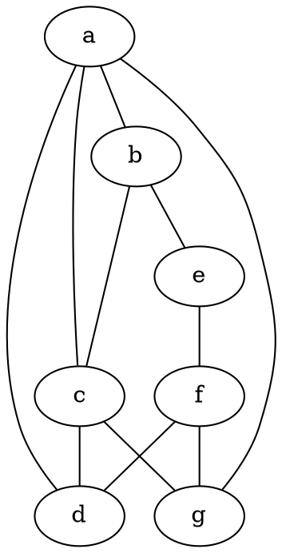

# Diskretne strukture (FiM) - vaje 10.12.2020

---

## Urejenosti

Delna urejenost $(A, \le)$, podmnožica $B \subseteq A$
* supremum: $x = \sup B \iff \forall y \in B: y \le x \land \forall z \in A: (\forall y \in B: y \le z \Rightarrow x \le z)$
* infimum: $x = \inf B \iff \forall y \in B: x \le y \land \forall z \in A: (\forall y \in B: z \le y \Rightarrow z \le x)$

---

### Naloga 1

Na <i>$\mathbb{R}^2$</i> definiramo relacijo <i>$\preceq$</i> takole:

$$
(x_1,y_1)\preceq(x_2,y_2) \Leftrightarrow
x_1 \leq x_2 {\rm\;in\;} y_1 \leq y_2.
$$

1. Pokaži, da je <i>$(\mathbb{R}^2, \preceq)$</i> delna urejenost.
2. Določi supremum in infimum elementov <i>$(1,3)$</i> in <i>$(2,4)$</i> ter supremum in infimum elementov <i>$(3,2)$</i> in <i>$(4,1)$</i>.

----

1. * Refleksivnost: <i>$(x_1, y_1) \preceq (x_1, y_1) \iff x_1 \le x_1 \land y_1 \le y_1$</i> velja

   * Antisimetričnost:

     $$
     \begin{aligned}
     (x_1, y_1) \preceq (x_2, y_2) \land (x_2, y_2) \preceq (x_1, y_1)
     &\Rightarrow x_1 \le x_2 \land y_1 \le y_2 \land x_2 \le x_1 \land y_2 \le y_1 \\
     &\Rightarrow x_1 = x_2 \land y_1 = y_2 \\
     &\Rightarrow (x_1, y_1) = (x_2, y_2)
     \end{aligned}
     $$

   * Tranzitivnost:

     $$
     \begin{aligned}
     (x_1, y_1) \preceq (x_2, y_2) \land (x_2, y_2) \preceq (x_3, y_3)
     &\Rightarrow x_1 \le x_2 \land y_1 \le y_2 \land x_2 \le x_3 \land y_2 \le y_3 \\
     &\Rightarrow x_1 \le x_3 \land y_1 \le y_3 \\
     &\Rightarrow (x_1, y_1) \preceq (x_3, y_3)
     \end{aligned}
     $$

2. * <i>$\sup\lbrace (1, 3), (2, 4) \rbrace = (2, 4)$</i>
   * <i>$\inf\lbrace (1, 3), (2, 4) \rbrace = (1, 3)$</i>
   * <i>$\sup\lbrace (3, 2), (4, 1) \rbrace = (4, 2)$</i>
   * <i>$\inf\lbrace (3, 2), (4, 1) \rbrace = (3, 1)$</i>
   * <i>$\sup\lbrace (x_1, y_1), (x_2, y_2) \rbrace = (\max\lbrace x_1, x_2 \rbrace, \max\lbrace y_1, y_2 \rbrace)$</i>
   * <i>$\inf\lbrace (x_1, y_1), (x_2, y_2) \rbrace = (\min\lbrace x_1, x_2 \rbrace, \min\lbrace y_1, y_2 \rbrace)$</i>

---

## Teorija grafov

(Neusmerjen) graf $G = (V, E)$
* $V$ ... množica vozlišč
* $E \subseteq {V \choose 2} = \lbrace \lbrace u, v \rbrace \mid u, v \in V \land u \ne v \rbrace$ ... množica povezav



* stopnja vozlišča $u$: <i>$d_G(u) = d(u) = |\lbrace e \in E \mid u \in e \rbrace|$</i>
* maksimalna stopnja grafa $G$: <i>$\Delta = \max_{u \in V} d_G(u)$</i>
* minimalna stopnja grafa $G$: <i>$\delta = \min_{u \in V} d_G(u)$</i>
* graf je *regularen*, če imajo vsa vozlišča enako stopnjo
* graf je *dvodelen*, če lahko zapišemo $V = A + B$, tako da velja, da za vsako povezavo $\lbrace u, v \rbrace \in E$ velja $u \in A$ in $v \in B$
* grafa <i>$G_1 = (V_1, E_1)$</i> in <i>$G_2 = (V_2, E_2)$</i> sta *izomorfna*, če obstaja bijektivna preslikava <i>$f : V_1 \to V_2$</i>, za katero velja

  $$
  \forall u, v \in V_1: (\{u, v\} \in E_1 \iff \{f(u), f(v)\} \in E_2)
  $$


---

### Naloga 2

Dan je graf $G=(V,E)$, kjer je $V = \lbrace 1,2,3,4,5 \rbrace$ in $E = \lbrace \lbrace 1,2 \rbrace, \lbrace 1,4 \rbrace, \lbrace 1,5 \rbrace, \lbrace 2,3 \rbrace, \lbrace 2,4 \rbrace, \lbrace 3,4 \rbrace, \lbrace 4,5 \rbrace \rbrace$.

1. Čim lepše nariši graf $G$.
2. Poišči stopnje vseh vozlišč ter minimalno in maksimalno stopnjo grafa $G$. Ali je graf regularen?
3. Ali je graf dvodelen?

----

1. ```graphviz
   graph G {
   1 -- 2
   1 -- 4
   1 -- 5
   2 -- 3
   2 -- 4
   3 -- 4
   4 -- 5
   }
   ```

2. * $d(1) = 3$
   * $d(2) = 3$
   * $d(3) = 2$
   * $d(4) = 4$
   * $d(5) = 2$
   * $\Delta(G) = 4$
   * $\delta(G) = 2$
   * zaporedje stopenj: $2, 2, 3, 3, 4$
   * graf ni regularen

3. Graf ni dvodelen, saj vsebuje lihe cikle (trikotniki, petkotnik).

---

### Naloga 3

Na zabavi se je zbralo $13$ ljudi. Vsak je s seboj prinesel $3$ darila, ki bi jih rad izmenjal s tremi drugimi udeleženci zabave. Ali je to izvedljivo? Predstavi kot problem iz teorije grafov in ga reši.

----

* $G = (V, E)$
* $V$ ... udeleženci, <i>$|V| = 13$</i>
* $\lbrace u, v \rbrace \in E$, če si $u$ in $v$ izmenjata darilo
* graf je $3$-regularen: <i>$d_G(u) = 3$</i> za vse $u \in V$
* **lema o rokovanju**: <i>$\sum_{u \in V} d_G(u) = 2 |E|$</i>
* <i>$|E| = {13 \cdot 3 \over 2} = 19.5$</i>
* **ni izvedljivo**

---

### Naloga 4

Ali sta spodnja grafa izomorfna?


----

* <i>$|V_1| = |V_2| = 5$</i>
* <i>$|E_1| = |E_2| = 8$</i>
* zaporedje stopenj:
  - <i>$G_1$</i>: 2, 3, 3, 4, 4
  - <i>$G_2$</i>: 3, 3, 3, 3, 4
  - grafa **nista izomorfna**

---

### Naloga 5

Ali sta spodnja grafa izomorfna?


----

* <i>$|V_1| = |V_2| = 8$</i>
* <i>$|E_1| = |E_2| = 12$</i>
* grafa sta $3$-regularna
* izomorfizem:
  - $a \to 1$
  - $b \to 2$
  - $c \to 3$
  - $e \to 5$
  - $g \to 7$
  - $h \to 8$
  - $d \to 4$
  - $f \to 6$
* grafa **sta izomorfna**

---

### Naloga 6

Ali sta spodnja grafa izomorfna? Nasvet: v vsakem od grafov preštej cikle dolžine $4$.


----

* <i>$|V_1| = |V_2| = 12$</i>
* grafa sta $3$-regularna
* cikli dolžine $4$:
  - <i>$G_1$</i>: abce, adge, bcfi, dgjk, fhli, hjkl, 6 ciklov
  - <i>$G_2$</i>: (1, 2, 3, 5); (1, 4, 7, 5); (6, 8, 12, 9); (8, 10, 11, 12); 4 cikli
  - grafa **nista izomorfna**
