# Diskretne strukture (FiM) - vaje 16.12.2020

---

## Teorija grafov

### Naloga 1

Poišči vse neizomorfne enostavne grafe na treh ali štirih vozliščih.

----

#### 0 vozlišč

<i>$K_0 \cong G = (\emptyset, \emptyset)$</i>

#### 1 vozlišče

<i>$K_1 \cong P_0$</i>
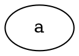

#### 2 vozlišči

<i>$\overline{K_2}$</i>
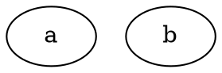

<i>$K_2 \cong P_1$</i>
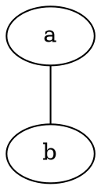

#### 3 vozlišča

0, 0, 0: <i>$\overline{K_3}$</i>
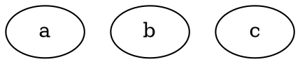

0, 1, 1: <i>$K_2 + K_1 \cong \overline{P_2}$</i>
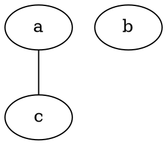

1, 1, 2: <i>$P_2$</i>
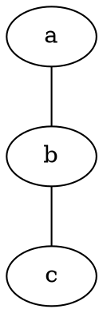

2, 2, 2: <i>$K_3 \cong C_3$</i>
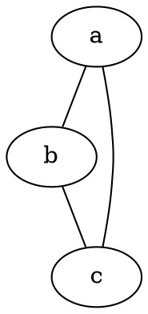

#### 4 vozlišča

0, 0, 0, 0: <i>$\overline{K_4}$</i>
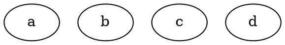

0, 0, 1, 1: <i>$K_2 + 2K_1$</i>
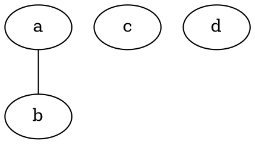

0, 1, 1, 2: <i>$P_2 + K_1$</i>
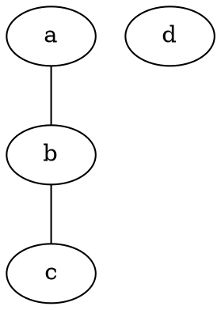
1, 1, 1, 1: <i>$2K_2$</i>
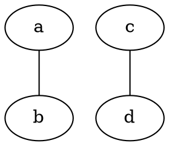

0, 2, 2, 2: <i>$K_3 + K_1$</i>
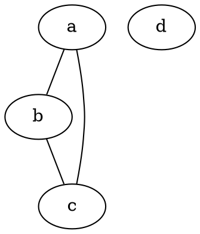

1, 1, 1, 3: <i>$\overline{K_3 + K_1}$</i>
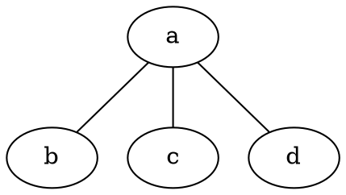


1, 1, 2, 2: <i>$P_3 \cong \overline{P_3}$</i>
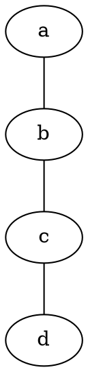

2, 2, 2, 2: <i>$C_4$</i>
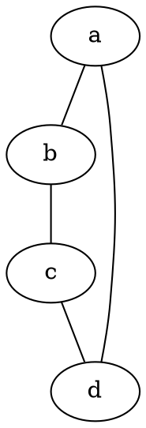

1, 2, 2, 3: <i>$\overline{K_3 + K_1}$</i>
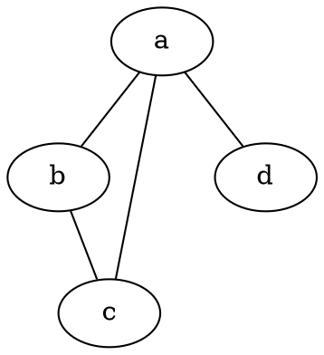

2, 2, 3, 3: <i>$\overline{K_2 + 2K_1}$</i>
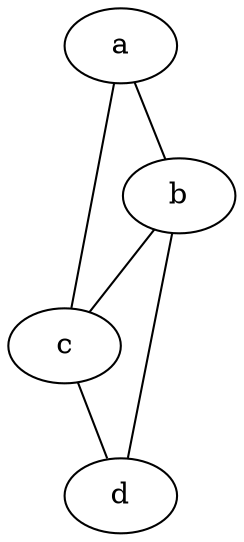

3, 3, 3, 3: <i>$K_4$</i>
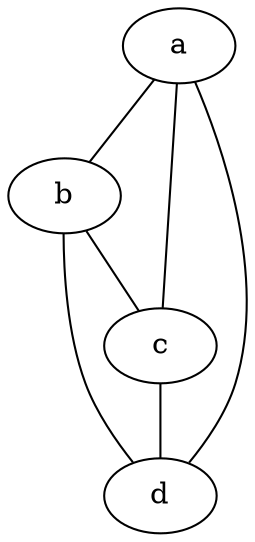


---

### Naloga 2

Poišči komplement grafa <i>$G=(V,E)$</i>, kjer je

$$
\begin{aligned}
V &= \{1,2,3,4,5\} \quad \text{in} \\
E &= \{\{1,2\},\{2,3\}, \{2,4\},\{2,5\},\{3,4\},\{4,5\}\}.
\end{aligned}
$$

----

* Komplement grafa <i>$G = (V, E)$</i> je graf <i>$\overline{G} = (V, \overline{E})$</i>, kjer je <i>$\overline{E} = {V \choose 2} \setminus E$</i>
* <i>$\overline{E} = \lbrace \lbrace 1, 3 \rbrace, \lbrace 1, 4 \rbrace, \lbrace 1, 5 \rbrace, \lbrace 3, 5 \rbrace \rbrace$</i>

<i>$G$</i>:
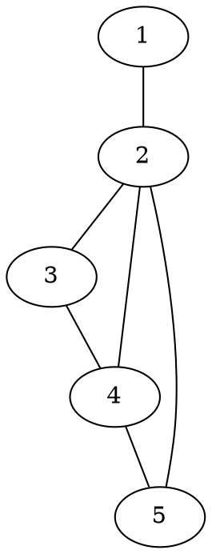

<i>$\overline{G}$</i>:
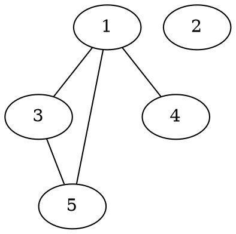

---

### Naloga 3

Poišči vse enostavne grafe na $5$ vozliščih, ki so izomorfni svojemu komplementu.

----

* <i>$|V| = 5$</i>
* <i>$|E| = |\overline{E}| = {5 \choose 2}/2 = 5$</i>
* zaporedje stopenj: <i>$a, b, 2, 4-b, 4-a$</i>

- <i>$0, b, 2, 4-b, 4$</i>: ni mogoče

- <i>$1, 1, 2, 3, 3$</i>:
  ```graphviz
  graph G1 {
    a -- d
    b -- e
    d -- c -- e
    d -- e
  }
  ```
  
  ```graphviz
  graph G1kom {
    a -- b
    a -- c
    a -- e
    c -- b -- d
  }
  ```
  
  Izomorfizem:
  + <i>$a \to d$</i>
  + <i>$b \to e$</i>
  + <i>$c \to c$</i>
  + <i>$d \to b$</i>
  + <i>$e \to a$</i>

- <i>$1, 2, 2, 2, 3$</i>:

  ```graphviz
  graph G2 {
    a -- e -- b -- c -- d -- e
  }
  ```

  ```graphviz
  graph G2kom {
    a -- b -- d
    a -- c -- e
    a -- d
  }
  ```
  
  Grafa nista izomorfna!

- $2, 2, 2, 2, 2$:

  ```graphviz
  graph G3 {
    a -- b -- c -- d -- e -- a
  }
  ```

  ```graphviz
  graph G3kom {
    a -- c -- e -- b -- d -- a
  }
  ```

  Opazimo, da sta grafa izomorfna.

---

### Naloga 4

Poišči vse neizomorfne enostavne grafe na $5$ vozliščih s $7$ povezavami.

Nasvet: dva grafa sta izomorfna natanko tedaj, ko sta izomorfna njuna komplementa.

----

Komplementi: $3$ povezave

0, 0, 2, 2, 2
```graphviz
graph G1 {
  a
  b
  c -- d -- e -- c
}
```

0, 1, 1, 1, 3
```graphviz
graph G2 {
  a
  b -- e
  c -- e
  d -- e
}
```

0, 1, 1, 2, 2
```graphviz
graph G3 {
  a
  b -- c -- d -- e
}
```

1, 1, 1, 1, 2
```graphviz
graph G4 {
  a -- b
  c -- e -- d
}
```

Grafi na $5$ vozliščih s $7$ povezavami:

```graphviz
graph G1kom {
  a -- b
  a -- c
  a -- d
  a -- e
  b -- c
  b -- d
  b -- e
}
```

```graphviz
graph G2kom {
  a -- b
  a -- c
  a -- d
  a -- e
  b -- c -- d -- b
}
```

```graphviz
graph G3kom {
  a -- b
  a -- c
  a -- d
  a -- e
  b -- d
  b -- e
  c -- e
}
```

```graphviz
graph G4kom {
  a -- c -- b
  a -- d -- b
  a -- e -- b
  c -- d
}
```

---

### Naloga 5

Pokaži, da so naslednje trditve ekvivalentne:

1. Graf je dvodelen.
2. Graf je 2-obarvljiv (vozlišča lahko pobarvamo z dvema barvama tako, da sosednji dve nista enako obarvani).
3. Graf ne vsebuje lihega cikla.

----

<i>$G = (V, E)$</i>

* <i>$(1 \Rightarrow 2)$</i>
  - predpostavka: <i>$V = A + B$</i>, <i>$\forall \lbrace u, v \rbrace \in E: (u \in A \land v \in B)$</i>
  - iščemo <i>$c : V \to 2$</i>, tako da za vsak <i>$\lbrace u, v \rbrace \in E$</i> velja <i>$c(u) \ne c(v)$</i>
  - <i>$c(u) = 0$</i> če <i>$u \in A$</i>, <i>$c(v) = 1$ če $v \in B$</i>

* <i>$(2 \Rightarrow 3)$</i>
  - predpostavka: imamo <i>$c : V \to 2$</i>, tako da za vsak <i>$\lbrace u, v \rbrace \in E$</i> velja <i>$c(u) \ne c(v)$</i>
  - recimo, da graf ima lih cikel <i>$u_1 u_2 \dots u_n$</i> za nek lih <i>$n$</i>
  - potem <i>$c(u_1) = c(u_n)$</i>, toda <i>$\lbrace u_1, u_n \rbrace \in E$</i>, protislovje
  - torej graf nima lihih ciklov

* <i>$(3 \Rightarrow 1)$</i>

---

### Naloga 6

Za spodnji graf preštej število podgrafov in število induciranih podgrafov.

```graphviz
graph G {
  a -- b
  a -- c
  b -- c
  b -- d
}
```
