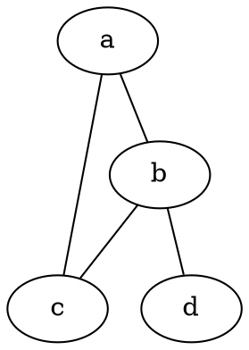

# Diskretne strukture (FiM) - vaje 17.12.2020

---

## Teorija grafov

### Naloga 1

Poišči vse neizomorfne enostavne grafe na treh ali štirih vozliščih.

---

### Naloga 2

Poišči komplement grafa $G=(V,E)$, kjer je

$$
\begin{aligned}
V &= \{1,2,3,4,5\} \quad \text{in} \\
E &= \{\{1,2\},\{2,3\}, \{2,4\},\{2,5\},\{3,4\},\{4,5\}\}.
\end{aligned}
$$

---

### Naloga 3

Poišči vse enostavne grafe na $5$ vozliščih, ki so izomorfni svojemu komplementu.

---

### Naloga 4

Poišči vse neizomorfne enostavne grafe na $5$ vozliščih s $7$ povezavami.

Nasvet: dva grafa sta izomorfna natanko tedaj, ko sta izomorfna njuna komplementa.

---

### Naloga 5

Pokaži, da so naslednje trditve ekvivalentne:

1. Graf je dvodelen.
2. Graf je 2-obarvljiv (točke lahko pobarvamo z dvema barvama tako, da sosednji dve nista enako obarvani).
3. Graf ne vsebuje lihega cikla.

---

### Naloga 6

Za spodnji graf preštej število podgrafov in število induciranih podgrafov.

