# Diskretne strukture (FiM) - vaje 17.12.2020

---

## Teorija grafov

### Naloga 1

Poišči vse neizomorfne enostavne grafe na treh ali štirih vozliščih.

----

#### 0 vozlišč

<i>$K_0 \cong G = (\emptyset, \emptyset)$</i>

#### 1 vozlišče

<i>$K_1 \cong P_0$</i>
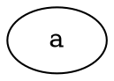

#### 2 vozlišči

<i>$\overline{K_2} \cong 2K_1$</i>
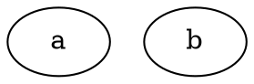

<i>$K_2 \cong P_1$</i>
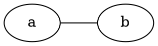

#### 3 vozlišča

<i>$\overline{K_3} \cong 3K_1$</i>
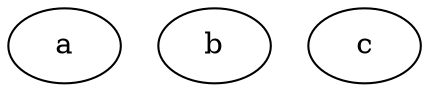

<i>$K_2 + K_1 \cong \overline{P_2}$</i>
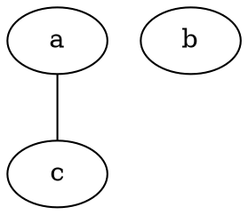

<i>$P_2$</i>
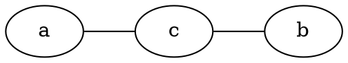

<i>$K_3 \cong C_3$</i>
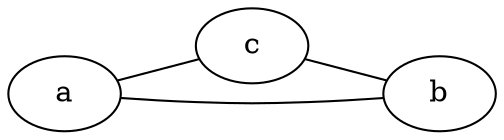

#### 4 vozlišča

0, 0, 0, 0: <i>$\overline{K_4}$</i>
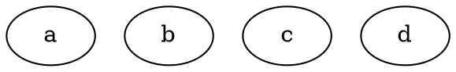

0, 0, 1, 1: <i>$K_2 + 2K_1$</i>
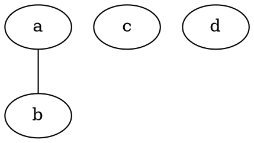

0, 1, 1, 2: <i>$P_2 + K_1$</i>
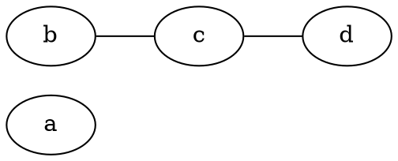

1, 1, 1, 1: <i>$2K_2 \cong \overline{C_4}$</i>
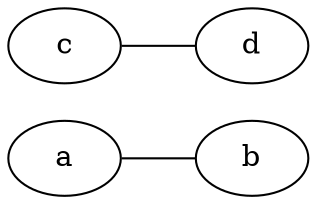

0, 2, 2, 2: <i>$K_3 + K_1$</i>
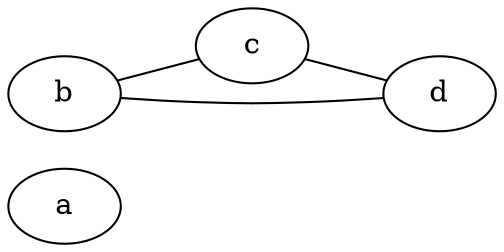

1, 1, 1, 3: <i>$\overline{K_3 + K_1}$</i>
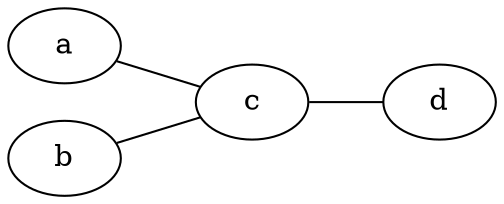

1, 1, 2, 2: <i>$P_3 \cong \overline{P_3}$</i>
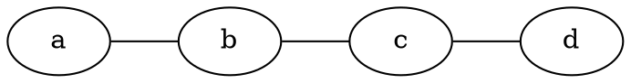

1, 2, 2, 3: <i>$\overline{P_2 + K_1}$</i>
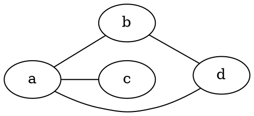

2, 2, 2, 2: <i>$C_4$</i>
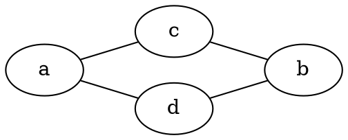

2, 2, 3, 3: <i>$\overline{K_2 + 2K_1}$</i>
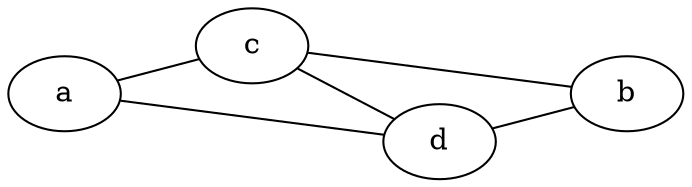

3, 3, 3, 3: <i>$K_4$</i>
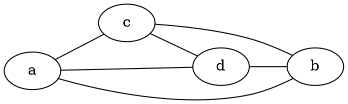

---

### Naloga 2

Poišči komplement grafa $G=(V,E)$, kjer je

$$
\begin{aligned}
V &= \{1,2,3,4,5\} \quad \text{in} \\
E &= \{\{1,2\},\{2,3\}, \{2,4\},\{2,5\},\{3,4\},\{4,5\}\}.
\end{aligned}
$$

----

* Komplement grafa <i>$G = (V, E)$</i> je graf <i>$\overline{G} = (V, \overline{E})$</i>, kjer je <i>$\overline{E} = {V \choose 2} \setminus E$</i>
* <i>$\overline{E} = \lbrace \lbrace 1, 3 \rbrace, \lbrace 1, 4 \rbrace, \lbrace 1, 5 \rbrace, \lbrace 3, 5 \rbrace \rbrace$</i>

$G$:
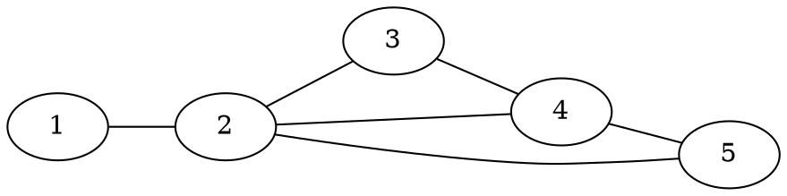

$\overline{G}$:
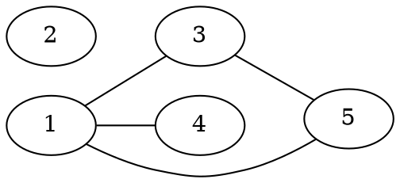

---

### Naloga 3

Poišči vse enostavne grafe na $5$ vozliščih, ki so izomorfni svojemu komplementu.

----

* <i>$|V| = 5$</i>
* <i>$|E| = |\overline{E}| = {5 \choose 2}/2 = 5$</i>
* zaporedje stopenj: <i>$a, b, 2, 4-b, 4-a$</i>

- $0, b, 2, 4-b, 4$: ni mogoče

- $1, 1, 2, 3, 3$

  ```graphviz
  graph G1 {
    rankdir=LR
    a -- d
    e -- b
    e -- c
    e -- d
    c -- d
  }
  ```
  
  ```graphviz
  graph G1kom {
    rankdir=LR
    a -- b
    a -- c
    a -- e
    b -- c
    b -- d
  }
  ```
  
  Izomorfizem:
  + $a \to e$
  + $b \to d$
  + $c \to c$
  + $d \to a$
  + $e \to b$

- $1, 2, 2, 2, 3$

  ```graphviz
  graph G2 {
    rankdir=LR
    a -- b
    c -- e -- d -- c
    e -- b
  }
  ```
  
  ```graphviz
  graph G2kom {
    rankdir=LR
    a -- c -- b
    a -- d -- b
    a -- e
  }
  ```
  
  Grafa nista izomorfna (en ima 3-cikel, drugi pa ne).

- $2, 2, 2, 2, 2$

  ```graphviz
  graph G3 {
    rankdir=LR
    a -- b -- c -- d -- e -- a
  }
  ```

  ```graphviz
  graph G3 {
    rankdir=LR
    a -- c -- e -- b -- d -- a
  }
  ```
  
  Grafa sta izomorfna.

---

### Naloga 4

Poišči vse neizomorfne enostavne grafe na $5$ vozliščih s $7$ povezavami.

Nasvet: dva grafa sta izomorfna natanko tedaj, ko sta izomorfna njuna komplementa.

----

Grafi na 5 vozliščih s 3 povezavami:

0, 0, 2, 2, 2
```graphviz
graph G1 {
  rankdir=LR
  a
  b
  c -- d -- e -- c
}
```

0, 1, 1, 1, 3
```graphviz
graph G2 {
  rankdir=LR
  a
  b -- e
  c -- e -- d
}
```

0, 1, 1, 2, 2
```graphviz
graph G3 {
  rankdir=LR
  a
  b -- c -- d -- e
}
```

1, 1, 1, 1, 2
```graphviz
graph G4 {
  rankdir=LR
  a -- b
  c -- d -- e
}
```

Komplementi: 7 povezav

```graphviz
graph G1kom {
  rankdir=LR
  a -- b
  a -- c -- b
  a -- d -- b
  a -- e -- b
}
```

```graphviz
graph G2kom {
  rankdir=LR
  a -- b
  a -- c
  a -- d
  a -- e
  b -- c -- d -- b
}
```

```graphviz
graph G3kom {
  rankdir=LR
  a -- b
  a -- c
  a -- d
  a -- e
  c -- e -- b -- d
}
```

```graphviz
graph G4kom {
  rankdir=LR
  a -- c -- b
  a -- d -- b
  a -- e -- b
  c -- e
}
```

---

### Naloga 5

Pokaži, da so naslednje trditve ekvivalentne:

1. Graf je dvodelen.
2. Graf je 2-obarvljiv (vozlišča lahko pobarvamo z dvema barvama tako, da sosednji dve nista enako obarvani).
3. Graf ne vsebuje lihega cikla.

----

* $(1 \Rightarrow 2)$

* $(2 \Rightarrow 3)$

* $(3 \Rightarrow 1)$
  - predpostavka: <i>$G$</i> ne vsebuje lihega cikla
  - dokazujemo, da <i>$V = A + B$</i>, tako da za vsako <i>$\lbrace u, v \rbrace \in E$</i> velja <i>$u \in A$</i>, <i>$v \in B$</i>
  - izberemo vozlišče <i>$u_0 \in V$</i>, naj bo <i>$u_0 \in A$</i>
  - za vsako <i>$\lbrace u, v \rbrace \in E$</i> z <i>$u \in A$</i> naj bo <i>$v \in B$</i>
  - za vsako <i>$\lbrace u, v \rbrace \in E$</i> z <i>$u \in B$</i> naj bo <i>$v \in A$</i>
  - ker nimamo lihih ciklov, sta množici <i>$A$</i> in <i>$B$</i> disjunktni
  - torej je graf <i>$G$</i> dvodelen

---

### Naloga 6

Za spodnji graf preštej število podgrafov in število induciranih podgrafov.

```graphviz
graph G {
  rankdir=LR
  a -- b
  a -- c
  b -- c
  b -- d
}
```
