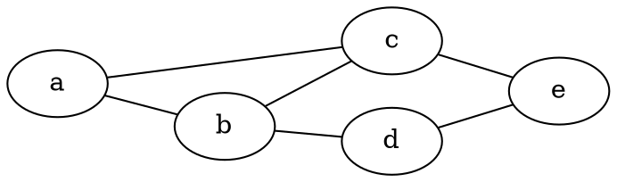
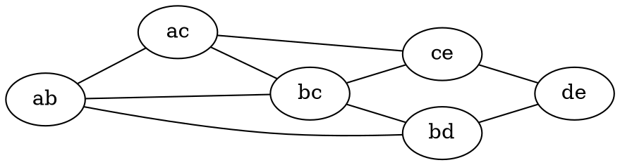
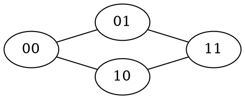
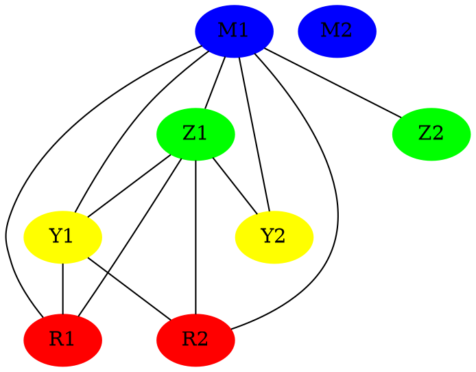

# Diskretne strukture (FiM) - vaje 23.12.2020

---

## Teorija grafov

### Naloga 1

Pokaži, da so hiperkocke dvodelni grafi.

----

Hiperkocka ${Q_n} = (V, E)$:
* $V = \lbrace 0, 1 \rbrace^n = A + B$
* $E = \lbrace \lbrace u, v \rbrace \mid u-v \text{ ima natanko en neničeln element} \rbrace$
* $A = \lbrace u \in V \mid u \text{ ima sodo število enic} \rbrace$
* $B = \lbrace v \in V \mid v \text{ ima liho število enic} \rbrace$
* za vsako povezavo $\lbrace u, v \rbrace \in E$ velja $u \in A$ in $v \in B$
* graf ${Q_n}$ je torej dvodelen

---

### Naloga 2

Poišči graf povezav spodnjega grafa. Izračunaj, koliko vozlišč in koliko povezav ima graf povezav v splošnem.

----

Za graf $G = (V, E)$ je **graf povezav** $L(G) = (V', E')$ tak graf, da velja:
* $V' = E$
* <i>$\lbrace e, f \rbrace \in E' \iff |e \cap f| = 1$</i>
* <i>$|V'| = |E|$</i>
* <i>$|E'| = {1 \over 2} {\sum_{e \in E}} {d_{L(G)}(e)} = {\sum_{u \in V}} {d_G(u) \choose 2}$</i>
* ${d_{L(G)}(\lbrace u, v \rbrace)} = {d_G(u)} + {d_G(v)} - 2$

* Stopnje v $G$: 2, 2, 2, 3, 3
* $3 \cdot {2 \choose 2} + 2 \cdot {3 \choose 2} = 3 + 6 = 9$ povezav

---

### Naloga 3

Pokaži, da je kartezični produkt dvodelnih grafov $G$ in $H$ dvodelen graf.

----

* Dana sta grafa $G = ({V_1}, {E_1})$, $H = ({V_2}, {E_2})$.
* **Kartezični produkt** $G \square H = (V, E)$:
  * $V = {V_1} \times {V_2} = \lbrace ({u_1}, {u_2}) \mid {u_1} \in {V_1}, {u_2} \in {V_2} \rbrace$
  * $\lbrace ({u_1}, {u_2}), ({v_1}, {v_2}) \rbrace \in E \iff (\lbrace {u_1}, {v_1} \rbrace \in {E_1} \land {u_2} = {v_2}) \lor ({u_1} = {v_1} \land \lbrace {u_2}, {v_2} \rbrace \in {E_2})$
* Predpostavimo, da sta $G$ in $H$ dvodelna z razdelitvama množic vozlišč ${V_1} = {A_1} + {B_1}$ in ${V_2} = {A_2} + {B_2}$
* $A = {A_1} \times {A_2} + {B_1} \times {B_2}$
* $B = {B_1} \times {A_2} + {A_1} \times {B_2}$
* vse povezave iz $E$ imajo eno krajišče v $A$ in eno krajišče v $B$
* graf $G \square H$ je torej dvodelen

Za hiperkocke velja ${Q_{m+n}} = {Q_n} \square {Q_m}$.

---

### Naloga 4

Izračunaj premer hiperkocke ${Q_n}$.

----

* Razdalja med vozliščema $u, v$: $\partial(u, v) =$ dolžina najkrajše poti od $u$ do $v$
* Premer grafa $G = (V, E)$: $D(G) = {\max_{u, v \in V}} \partial(u, v)$

Hiperkocka ${Q_n} = (V, E)$:
* <i>$\partial(u, v) = \sum_{i=1}^n |{u_i} - {v_i}|$</i>
* $D({Q_n}) = n$

---

### Naloga 5

V cirkuški predstavi nastopajo $4$ pari klovnov: $2$ rdeča, $2$ modra, $2$ zelena in $2$ rumena. Med predstavo se zaletavajo med seboj, a nikoli se ne zaletita dva klovna iste barve. Nekega dne je prvi rdeči klovn vprašal ostalih $7$, v koliko drugih klovnov so se zaleteli. Dobil je same različne odgovore. V koliko klovnov se je med predstavo zaletel drugi rdeči klovn? Zapiši nalogo v jeziku teorije grafov in jo reši.

Prirejeno po S. Klavžar, Presek, letnik 26, številka 2, strani 72-78.

----

$G = (V, E)$:
* $V$ ... klovni
* $\lbrace u, v \rbrace \in E$ ... $u$ in $v$ sta se zaletela
* stopnje: 0, 1, 2, 3, 4, 5, 6, $x \in \lbrace 1, 3, 5 \rbrace$

Oba rdeča klovna sta se zaletela trikrat.

---

### Naloga 6

Naj bo $G = (V, E)$ enostaven graf z minimalno stopnjo vsaj $\lfloor n/2 \rfloor$, kjer je <i>$n = |V|$</i>. Pokaži, da je potem $G$ povezan.

----

Graf $G = (V, E)$ je povezan, če za vsaki vozlišči $u, v \in V$ obstaja pot od $u$ do $v$ v grafu $G$.

* Naj bosta $u, v \in V$ nesosednji vozlišči.
* Naj bosta $A$ in $B$ množici sosedov vozlišč $u$ oziroma $v$.
* Vemo <i>$|A|, |B| \ge \lfloor n/2 \rfloor$</i>.
* <i>$|\lbrace u, v \rbrace \cup A \cup B|$ $\stackrel{?}{=}$</i> <i>$|\lbrace u, v \rbrace| + |A| + |B| \ge 2 + n - 1 = n + 1$</i>
* enačaja ne moremo imeti, torej množici $A, B$ nista disjunktni
* torej obstaja $w \in A \cap B$ in tako obstaja pot $uwv$
* graf $G$ je torej povezan

---

### Naloga 7

Naj bo $G = (V, E)$ enostaven graf. Pokaži, da je tedaj $G$ povezan ali pa je povezan njegov komplement.

----

Denimo, da graf $G = (V, E)$ ni povezan. Naj bosta $u, v \in V$.
* Če $\lbrace u, v \rbrace \not\in E$, potem $\lbrace u, v \rbrace \in \overline{E}$.
* Če $\lbrace u, v \rbrace \in E$, naj bo $w$ vozlišče v drugi povezani komponenti kot $u, v$. Potem v $\overline{G}$ obstaja pot $uwv$.

Graf $\overline{G}$ je torej povezan.

---

### Naloga 8

Naj bo $G = (V, E)$ povezan graf. Povezava $e \in E$ je *most*, če $G \backslash \lbrace e \rbrace$ ni več povezan. Pokaži: če ima $G$ most, potem ima vsaj dve vozlišči lihe stopnje.
