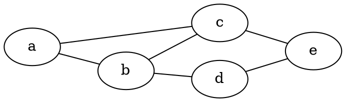

# Diskretne strukture (FiM) - vaje 23.12.2020

---

## Teorija grafov

### Naloga 1

Pokaži, da so hiperkocke dvodelni grafi.

---

### Naloga 2

Poišči graf povezav spodnjega grafa. Izračunaj, koliko vozlišč in koliko povezav ima graf povezav v splošnem.

---

### Naloga 3

Pokaži, da je kartezični produkt dvodelnih grafov $G$ in $H$ dvodelen graf.

---

### Naloga 4

Izračunaj premer hiperkocke $Q_n$.

---

### Naloga 5

V cirkuški predstavi nastopajo $4$ pari klovnov: $2$ rdeča, $2$ modra, $2$ zelena in $2$ rumena. Med predstavo se zaletavajo med seboj, a nikoli se ne zaletita dva klovna iste barve. Nekega dne je prvi rdeči klovn vprašal ostalih $7$, v koliko drugih klovnov so se zaleteli. Dobil je same različne odgovore. V koliko klovnov se je med predstavo zaletel drugi rdeči klovn? Zapiši nalogo v jeziku teorije grafov in jo reši.

Prirejeno po S. Klavžar, Presek, letnik 26, številka 2, strani 72-78.

---

### Naloga 6

Naj bo $G = (V, E)$ enostaven graf z minimalno stopnjo vsaj $\lfloor n/2 \rfloor$, kjer je <i>$n = |V|$</i>. Pokaži, da je potem $G$ povezan.

---

### Naloga 7

Pokaži, da je tedaj $G$ povezan ali pa je povezan njegov komplement.

---

### Naloga 8

Naj bo $G = (V, E)$ povezan graf. Povezava $e \in E$ je *most*, če $G \backslash \lbrace e \rbrace$ ni več povezan. Pokaži: če ima $G$ most, potem ima vsaj dve vozlišči lihe stopnje.
