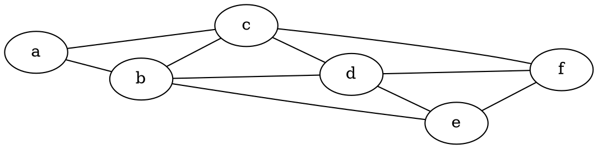
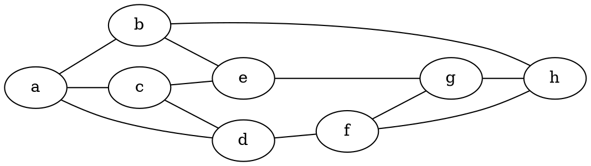
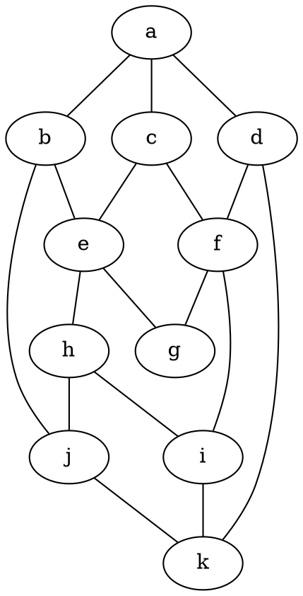
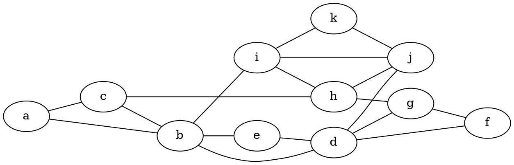
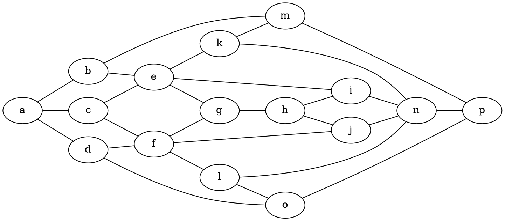
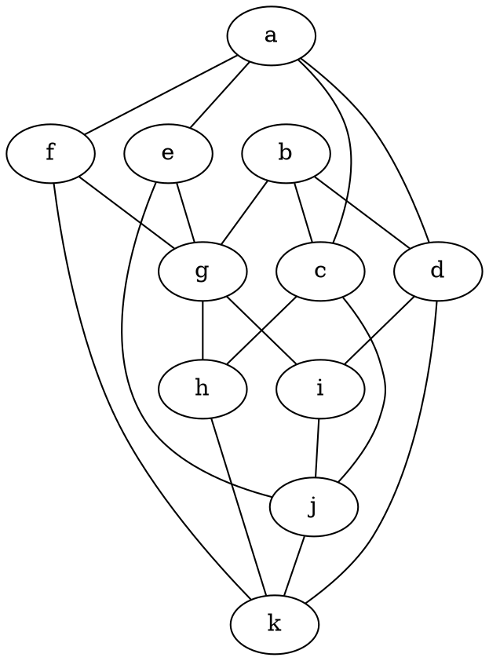

# Diskretne strukture (FiM) - vaje 6.1.2021

---

## Teorija grafov

### Naloga 1

Dokaži, da so vsa drevesa dvodelni grafi. Kateri polni dvodelni grafi so drevesa?

---

### Naloga 2

Naj bo $T$ drevo in $v$ njegovo vozlišče (koren drevesa). Naj ima vsako vozlišče stopnjo $3$ ali $1$, razen korena $v$, ki ima stopnjo $2$. Takemu drevesu pravimo **dvojiško drevo**. Naj bodo vsi listi na razdalji $d$ od korena $v$. Koliko listov ima $T$?

---

### Naloga 3

Naj bo $T$ drevo s $17$ vozlišči, ki so vsa stopnje $1$ ali $4$. Koliko vozlišč stopnje $4$ ima $T$? Nariši kakšno takšno drevo.

---

### Naloga 4

Poišči vsa neizomorfna drevesa na $10$ vozliščih brez vozlišč stopnje $2$. Nato si oglej povezavi:
* <https://www.youtube.com/watch?v=N7b0cLn-wHU>
* <https://www.youtube.com/watch?v=iW_LkYiuTKE>

---

### Naloga 5

Ali ima kateri od grafov s spodnje slike Eulerjev obhod ali sprehod?
Če ne, koliko najmanj potez potrebujemo, da ga lahko narišemo?

---

### Naloga 6

Kateri od grafov na spodnji sliki imajo Hamiltonov cikel?

---

### Naloga 7

Ali je graf s spodnje slike Hamiltonov?

---

### Naloga 8

Ali se lahko šahovski konjiček sprehodi po šahovnici velikosti $3 \times 4$ tako, da vsako polje obišče natanko enkrat in konča tam, kjer je začel? Zapiši kot problem iz teorije grafov in ga reši.

---

### Naloga 9

Pokaži, da ima enostaven kubičen graf na $6$ vozliščih Hamiltonov cikel. S pomočjo te ugotovitve potem poišči vse neizomorfne kubične grafe na največ $6$ vozliščih.
