# Diskretne strukture (FiM) - vaje 6.1.2021

---

## Teorija grafov

Drevesa: povezani grafi brez ciklov
* $T = (V, E)$
* <i>$|E| = |V| - 1$</i>

Poln dvodelen graf ${K_{m,n}} = (V, E)$
* $V = A + B$, <i>$|A| = m$</i>, <i>$|B| = n$</i>
* $E = \lbrace \lbrace u, v \rbrace \mid u \in A, v \in B \rbrace$

Primer ${K_{2,3}}$

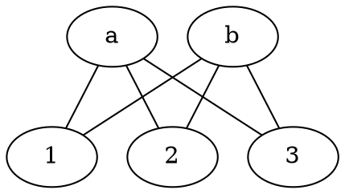

* Eulerjev obhod: obhod po vozliščih grafa (začnemo in končamo v istem vozlišču), kjer obiščemo vse povezave (posamezno vozlišče lahko obiščemo večkrat).
  - Graf ima Eulerjev obhod natanko tedaj, ko imajo vsa vozlišča sodo stopnjo.
* Eulerjev sprehod: sprehod po vozliščih grafa (začnemo in končamo lahko v različnih vozliščih), kjer obiščemo vse povezave (posamezno vozlišče lahko obiščemo večkrat).
  - Graf ima Eulerjev sprehod natanko tedaj, ko imamo največ dve vozlišči lihe stopnje.
* Hamiltonov cikel: obhod po vozliščih grafa, kjer vsako vozlišče obiščemo natanko enkrat.
* Hamiltonova pot: sprehod po vozliščih grafa, kjer vsako vozlišče obiščemo natanko enkrat.
  - Iskanje Hamiltonovih ciklov in poti je v splošnem težek problem!

---

### Naloga 1

Dokaži, da so vsa drevesa dvodelni grafi. Kateri polni dvodelni grafi so drevesa?

----

* Drevo nima ciklov, torej tudi lihih ciklov nima, torej je dvodelen graf.
* ${K_{1, n}} \cong {K_{n, 1}}$ zvezda
* ${K_{m, n}}$, $m, n \ge 2$: $u, v \in A$, $x, y \in B$, cikel $uxvy$, torej ni drevo

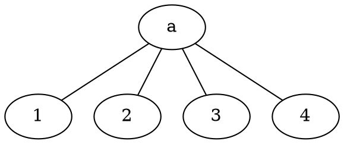

---

### Naloga 2

Naj bo $T$ drevo in $v$ njegovo vozlišče (koren drevesa). Naj ima vsako vozlišče stopnjo $3$ ali $1$, razen korena $v$, ki ima stopnjo $2$. Takemu drevesu pravimo **dvojiško drevo**. Naj bodo vsi listi na razdalji $d$ od korena $v$. Koliko listov ima $T$?

----

* Število listov: $2^d$
* Število vozlišč: ${\sum_{i=0}^d} 2^i = 2^{d+1} - 1$

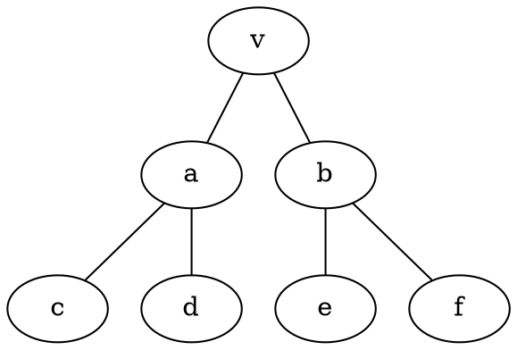

---

### Naloga 3

Naj bo $T$ drevo s $17$ vozlišči, ki so vsa stopnje $1$ ali $4$. Koliko vozlišč stopnje $4$ ima $T$? Nariši kakšno takšno drevo.

----

* $|E| = |V| - 1 = 16$
* $x$ ... št. vozlišč stopnje 4
* Lema o rokovanju: <i>$\sum_{u \in V(T)} {d_T}(u) = x \cdot 4 + (17-x) \cdot 1 = 2|E| = 32$</i>
* $3x = 15$
* $x = 5$

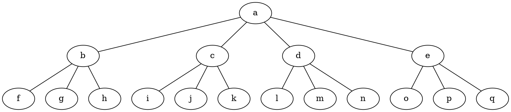

---

### Naloga 4

Poišči vsa neizomorfna drevesa na $10$ vozliščih brez vozlišč stopnje $2$. Nato si oglej povezavi:
* <https://www.youtube.com/watch?v=N7b0cLn-wHU>
* <https://www.youtube.com/watch?v=iW_LkYiuTKE>

----

$T = (V, E)$
* <i>$|V| = 10$</i>
* <i>$|E| = 9$</i>
* $\forall u \in V: {d_T}(u) \ne 2$

$1^9, 9$:
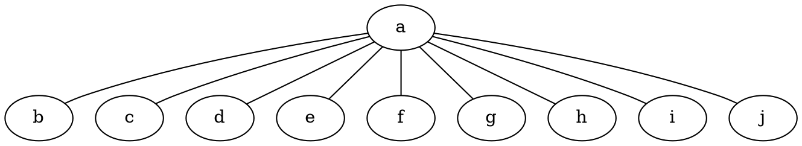

$1^8, 3, 7$:
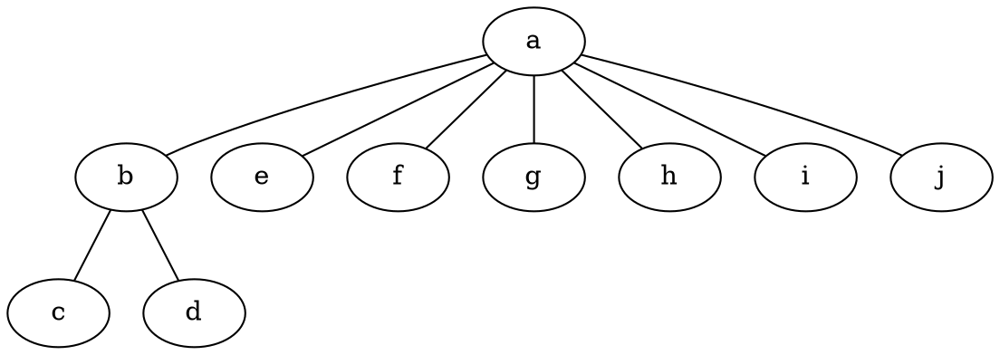

$1^8, 4, 6$:
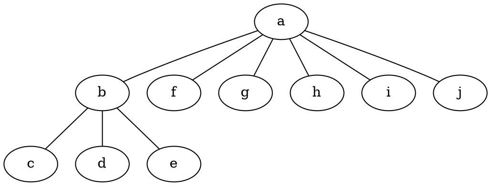

$1^8, 5^2$:
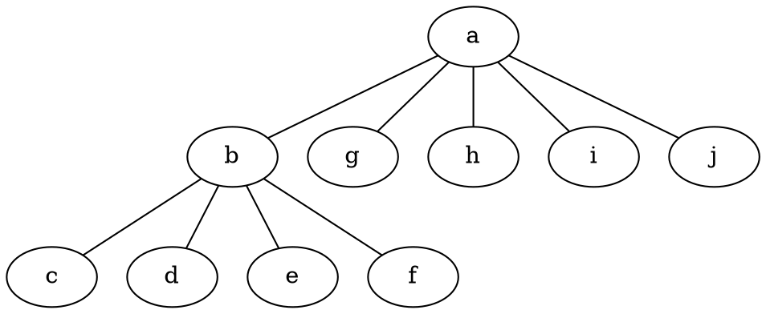

$1^7, 3^2, 5$:
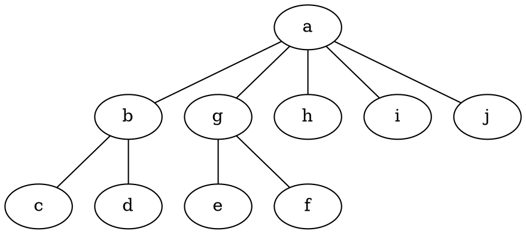

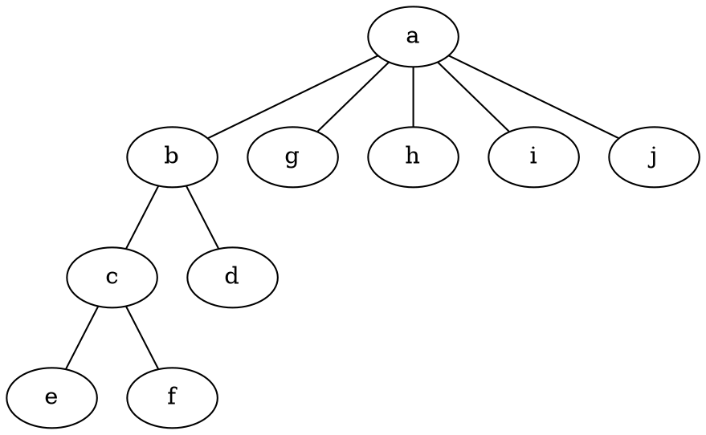

$1^7, 3, 4^2$:
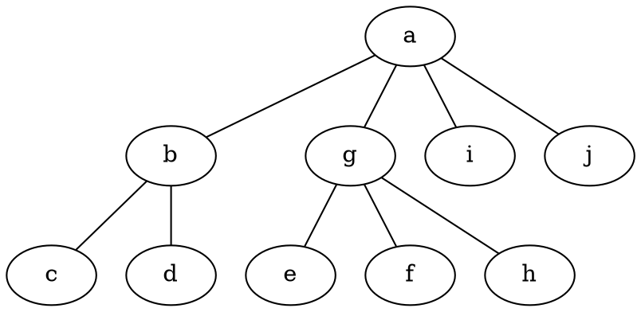

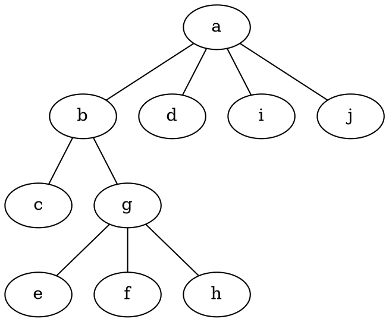

$1^6, 3^4$:
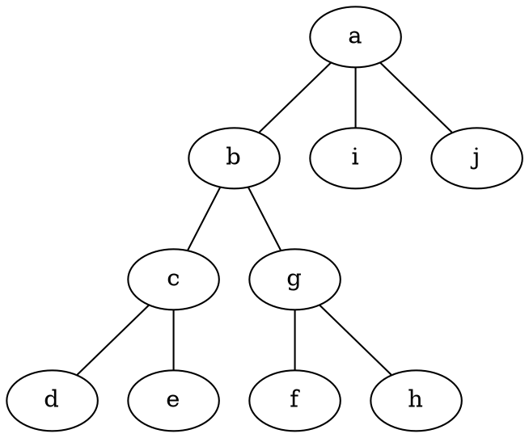

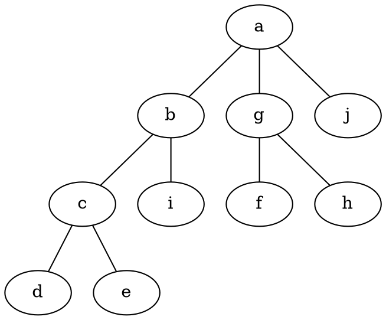

---

### Naloga 5

Ali ima kateri od grafov s spodnje slike Eulerjev obhod ali sprehod?
Če ne, koliko najmanj potez potrebujemo, da ga lahko narišemo?

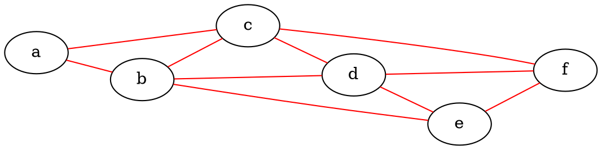

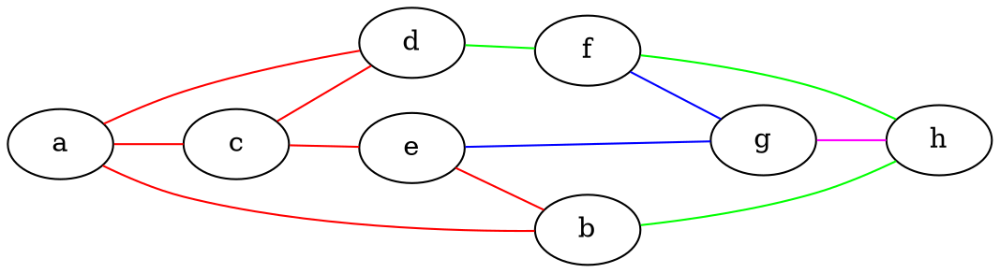

----

1. ${G_1}$:
   * ni Eulerjevega obhoda
   * Eulerjev sprehod: $ebacbdcfdef$

2. ${G_2}$:
   * ni Eulerjevega obhoda ali sprehoda
   * poteze: $acdabec$, $bhfd$, $egf$, $gh$

---

### Naloga 6

Kateri od grafov na spodnji sliki imajo Hamiltonov cikel?

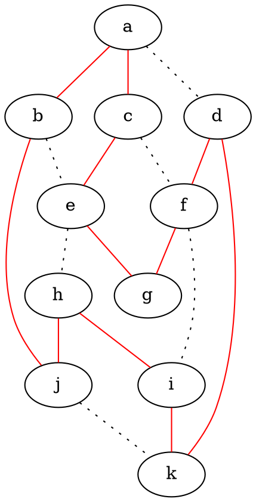

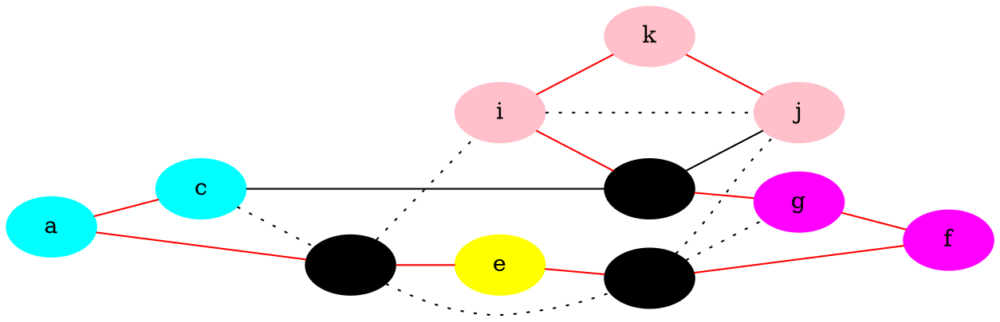

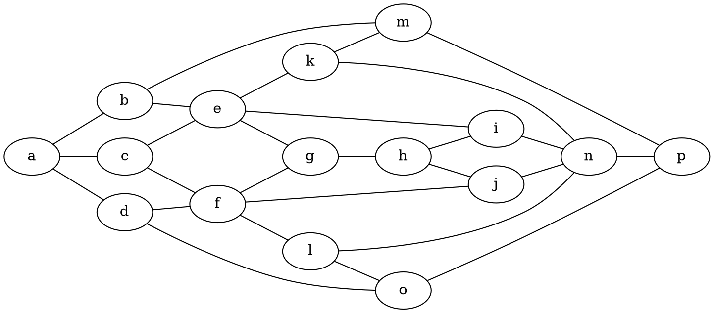

----

1. ${G_1}$: našli smo Hamiltonov cikel
2. ${G_2}$:
   - našli smo Hamiltonovo pot
   - če odstranimo $3$ vozlišča, graf razpade na $4$ povezane komponente, zato nima Hamiltonovega cikla
3. ${G_3}$: nima Hamiltonove poti - DN

---

### Naloga 7

Ali je graf s spodnje slike Hamiltonov?

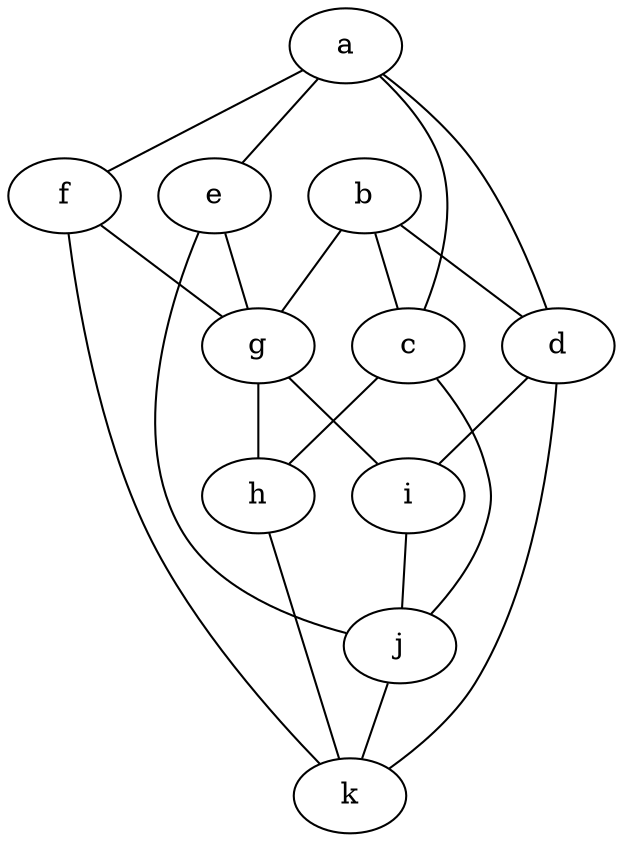

---

### Naloga 8

Ali se lahko šahovski konjiček sprehodi po šahovnici velikosti $3 \times 4$ tako, da vsako polje obišče natanko enkrat in konča tam, kjer je začel? Zapiši kot problem iz teorije grafov in ga reši.

---

### Naloga 9

Pokaži, da ima enostaven kubičen graf na $6$ vozliščih Hamiltonov cikel. S pomočjo te ugotovitve potem poišči vse neizomorfne kubične grafe na največ $6$ vozliščih.
