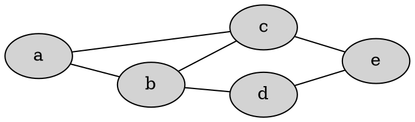
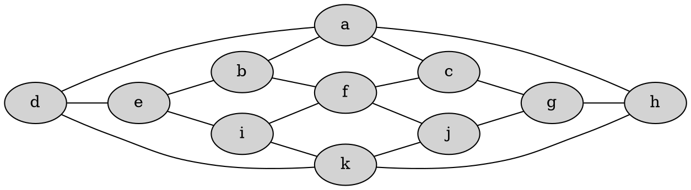
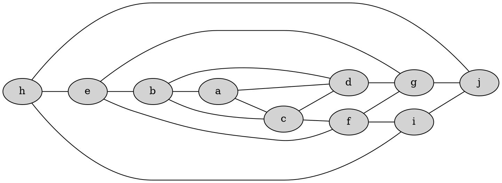
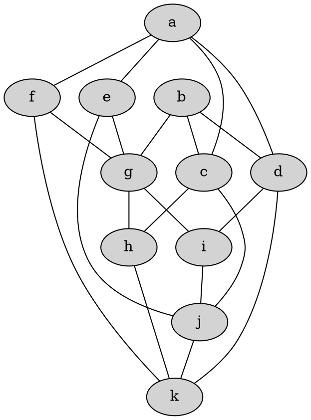

# Diskretne strukture (FiM) - vaje 13.1.2021

---

## Teorija grafov

### Naloga 1

Za spodnje grafe ugotovi, ali so ravninski.

1. 
2. 
3. 
4. 

---

### Naloga 2

Pokaži, da ima kubičen graf v ravnini, pri katerem so vsa lica petkotniki ali šestkotniki, natanko $12$ petkotnikov.

---

### Naloga 3

Naj bo $G$ enostaven graf, ki ima $11$ vozlišč. Pokaži, da potem $G$ ni ravninski ali pa njegov komplement ni ravninski.

---

### Naloga 4

Naj bo $G$ regularen graf stopnje $p \ge 3$, vložen v ravnino tako, da imajo vsa lica enako število povezav $q \ge 3$ na robu. Kakšna sta lahko $p$ in $q$?

---

### Naloga 5

Za grafe na spodnji sliki poišči njihovo barvnost.

