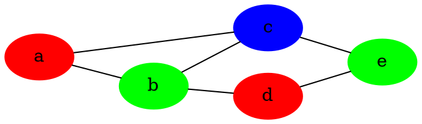
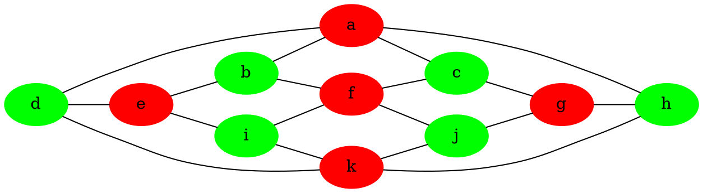
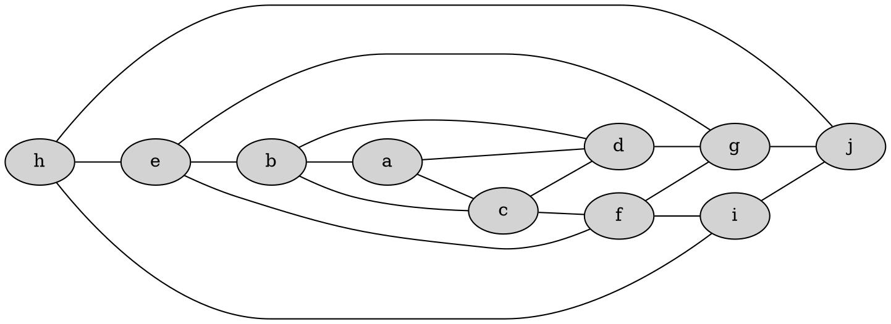
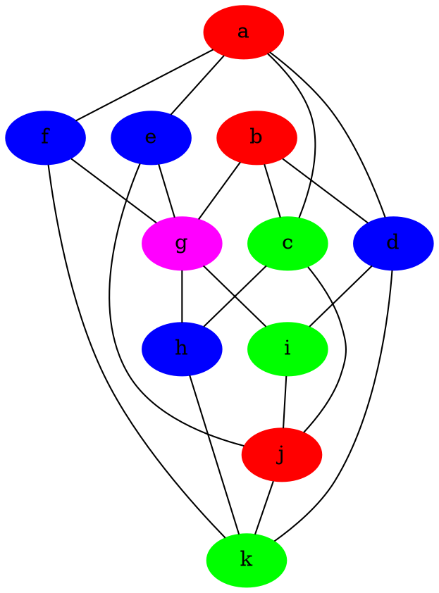

# Diskretne strukture (FiM) - vaje 14.1.2021

---

## Teorija grafov

* Graf $G = (V, E)$ je **ravninski**, če obstaja **vložitev** v ravnino (tj., povezave se ne sekajo).
* Graf ni ravninski natanko tedaj, ko ima **minor** ${K_5}$ ali ${K_{3, 3}}$ (tj., tak graf dobimo s krčenjem povezav ter odstranjevanjem vozlišč in povezav).
* $v - e + f = 2$, kjer je $v$ število vozlišč, $e$ število povezav in $f$ število lic
  - velja za povezane grafe
  - v splošnem: $v - e + f = 1 +$ število povezanih komponent

---

### Naloga 1

Za spodnje grafe ugotovi, ali so ravninski.

1. 
2. 
3. 
4. 

----

1. ```graphviz
   graph G1 {
     rankdir=LR
     a -- b -- c -- d -- h -- g -- f -- e -- a
     a -- f -- b -- g -- c -- h
     e -- b
     f -- c
     g -- d
   }
   ```
   Graf je ravninski.

2. ```graphviz
   graph G2 {
     rankdir=LR
     a -- b -- c -- d -- h -- g -- f -- e -- a
     a -- f -- b -- g -- c -- h
     e -- b
     f -- c
     g -- d
     a -- d
   }
   ```
   Graf ni ravninski - dokaz za DN.

3. ```graphviz
   graph G3 {
     rankdir=LR
     node [style=filled]
     a [color=red]
     b [color=red]
     e [color=green]
     f [color=green]
     c [color=blue]
     d [color=cyan]
     g [color=magenta]
     h [color=yellow]
     
     a -- b [color=red]
     b -- c -- d -- e
     e -- f  [color=green]
     f -- g -- h -- a
     a -- e
     b -- f
     c -- g
     d -- h
   }
   ```
   Graf ni ravninski, ker ima minor ${K_{3, 3}}$:
   ```graphviz
   graph G3kontrakt {
     ab -- c
     ab -- ef
     ab -- h
     d -- c
     d -- ef
     d -- h
     g -- c
     g -- ef
     g -- h
   }
   ```

4. ```graphviz
   graph G4 {
     node [style=filled]
     
     e [color=red]
     b [color=red]
     d [color=red]
     f [color=red]
     h [color=red]
     j [color=red]
     a [color=green]
     c [color=blue]
     g [color=cyan]
     i [color=yellow]
     
     a -- c -- g -- i -- a -- g -- e -- c -- i
     b -- d -- h -- j -- b -- h -- f -- d -- j
     a -- b
     e -- f
     i -- j
   }
   ```
   Graf ni ravninski, ker ima minor ${K_5}$:
   ```graphviz
   graph G4kontrakt {
     ebdfhj -- a
     ebdfhj -- c
     ebdfhj -- g
     ebdfhj -- i
     a -- c
     a -- g
     a -- i
     c -- g
     c -- i
     g -- i
   }
   ```
---

### Naloga 2

Pokaži, da ima povezan kubičen graf v ravnini, pri katerem so vsa lica petkotniki ali šestkotniki, natanko $12$ petkotnikov.

----

* $v - e + f = 2$
* $3v = 2e = 5a + 6b$, kjer je $a$ število petkotnikov in $b$ število šestkotnikov
* $f = a + b$
* ${5a + 6b \over 3} - {5a + 6b \over 2} + a + b = 2$
* $-{5a + 6b \over 6} + a + b = 2$
* $a = 12$

---

### Naloga 3

Naj bo $G$ enostaven graf, ki ima $11$ vozlišč. Pokaži, da potem $G$ ni ravninski ali pa njegov komplement ni ravninski.

----

* $v = 11$
* Predpostavimo, da sta tako $G$ kot $\overline{G}$ ravninska grafa.
* $v - e + f \ge 2$
* $v - \overline{e} + \overline{f} \ge 2$
* $3f \le 2e$
* $3\overline{f} \le 2\overline{e}$
* $e + \overline{e} = 55$
* $2v - e - \overline{e} + f + \overline{f} \ge 4$
* $22 - 55 + f + \overline{f} \ge 4$
* $f + \overline{f} \ge 37$
* $f + \overline{f} \le {2 \over 3} (e + \overline{e}) = 36 {2 \over 3}$
* Dobimo protislovje, torej $G$ in $\overline{G}$ ne moreta biti oba ravninska.

---

### Naloga 4

Naj bo $G$ povezan regularen graf stopnje $p \ge 3$, vložen v ravnino tako, da imajo vsa lica enako število povezav $q \ge 3$ na robu. Kakšna sta lahko $p$ in $q$?

----

* $v - e + f = 2$
* $pv = 2e = qf$
* ${2e \over p} - e + {2e \over q} = 2$
* $e ({2 \over p} + {2 \over q} - 1) = 2$
* Rešitve:
  - $p = 3$: ${2 \over q} > {1 \over 3}$
    + $(p, q) = (3, 3)$: $e = 6$, $v = 4$, $f = 4$, tetraeder
    + $(p, q) = (3, 4)$: $e = 12$, $v = 8$, $f = 6$, kocka
    + $(p, q) = (3, 5)$: $e = 30$, $v = 20$, $f = 12$, dodekaeder
  - $p = 4$: ${2 \over q} > {1 \over 2}$
    + $(p, q) = (4, 3)$: $e = 12$, $v = 6$, $f = 8$, oktaeder
  - $p = 5$: ${2 \over q} > {3 \over 5}$
    + $(p, q) = (5, 3)$: $e = 30$, $v = 12$, $f = 20$, ikozaeder

---

### Naloga 5

Za grafe na spodnji sliki poišči njihovo barvnost.


Bravnost grafa je $3$ (ima $3$-cikel, našli smo $3$-barvanje).


Barvnost grafa je $2$ (graf je dvodelen).




Graf ima $5$-cikel, zato potrebujemo vsaj $3$ barve, vendar s $3$ barvami ni šlo, našli smo $4$-barvanje. Barvnost grafa je $4$.
